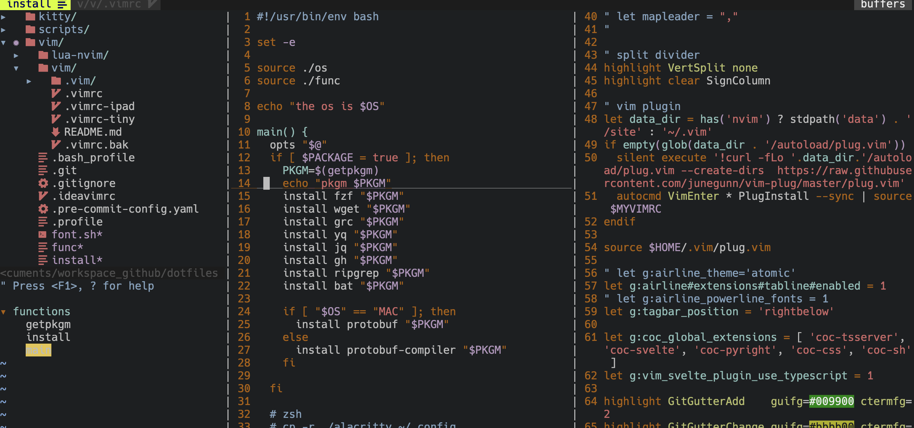

## vim rc files

.vimrc what I was originally used rc file, but after used nvim, it is little outdated,
so planning to update it.

the files in this folder purposing on respectively ..

### 1.vimrc

originally used configuration when I using vim as primary editor.
LSP configured with coc

look like this.

#### dependency

see .vim/ folder for plugins

### 2. vimrc-ipad

when use M1 mac ipad shell with alphine, there could be some disablity some of features,
so I've separated the file.

### 3. vimrc-tiny

very simple version of vimrc. it is purposing on not to use any plugin,
I am using when working as devops, very massive server is need to edited but plugin installation is a burden place, just short editing is required.

#### dependency

NO
